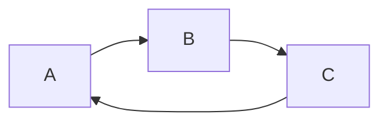

FuseBox 
=======

FuseBox is just a exercise in coding that I'm doing - writing a simple injection library for .NET Core. So, before you ask, nope: .NET Core doesn't need yet another injection framework. In fact, ASP.NET's embedded one is good enough for 99.9% of projects out there. I'm doing this for fun and experimenting (or maybe I'm just bored).

### The name...

One of my university teachers used to say that a great project starts with a good name. FuseBox is were we wire up buildings, and the IoC Container is where we wire up applications.

Iteration 1 - The basics
========================

The basic goal of an IoC container is to, given a certain type `T`, produce a instance of it. We will call that resolving:

`container.Resolve<T>()` 

Now, of course, if T has a parameterless constructor (`T: new()`) this would be very easy. But what if its constructor has parameters? The container will then create instances of the required parameters in those constructors, in order to be able to construct the desired type.

For now, we will require that types be registered within the container. In sum:

- The container should be able to resolve types into instances.
- If the type has a _parameterless_ constructor, the type is simply instantiated.
- If the type has a _parameterfull_ constructor, the containter attempts to resolve _dependent_ types.
- If the type has multiple contructors, the container will first try to resolve a constructor with the most parameters, then the second-most, then the third-most, etc. If no resolvable constructor is found, it will throw an `UnresolvableTypeException`.
- Dependencies that are primitive types should result in `UnresolvableTypeException` being thrown.

This are very basic rules but gives the very basic notion of how the container should behave.

Iteration 2 - Cyclic dependencies
=================================

Right now, we don't deal with a very basic problem when resolving the objects. If a certain object A depends on B, and B depends on A, we would end up with a cyclid dependency, which is unsolvable - you can't create an instace of A because to do so, you need to create B, and to create B, you need to create A... 

This can happen in different levels of indirection, so it's also cyclic if A → B → C → A:

Which means that A, B and C are unsolvable.

The goal of this iteration is simple: we must detect cyclid dependencies and fail with a proper exception, `CyclidDependencyException`. For now, that's all that is required, but informing the cycle would be very important.

One caveat that we must also consider when implementing is that types may have more than one constructor, and while one may represent a cycle, the other may not - in this case, FuseBox should resolve using the non-cyclic constructor.